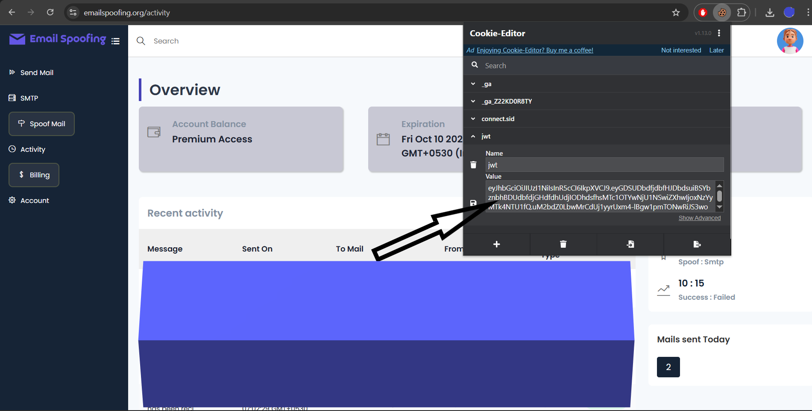

# Find your API Key on emailspoofing.org

**Important:** Do not expose your API key in public code or screenshots.

## 1. Open the website
1. Visit: `https://emailspoofing.org/spoof-mail`
2. Log in with your account credentials.

## 2. Install the "Cookie Editor" browser extension
Install a cookie editor extension for your browser (examples: *Cookie Editor* for Chrome/Edge).  
> search your browser's extension store for **"Cookie Editor"** and install it.

## 3. Reveal the API Key value
1. After logging in, click the cookie editor extension icon in your browser toolbar.
2. In the cookie list, search for the cookie name 'jwt' used by the site .  
3. The cookie value shown in the extension is your API key. Copy the value.

## Example Markdown to embed the screenshot
If you want to add an image (screenshot) to your README showing where the API key appears, use this:

```markdown

